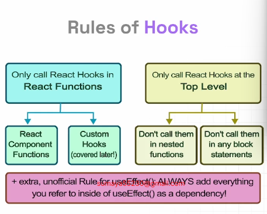

# React + Vite

This template provides a minimal setup to get React working in Vite with HMR and some ESLint rules.

Currently, two official plugins are available:

- [@vitejs/plugin-react](https://github.com/vitejs/vite-plugin-react/blob/main/packages/plugin-react/README.md) uses [Babel](https://babeljs.io/) for Fast Refresh
- [@vitejs/plugin-react-swc](https://github.com/vitejs/vite-plugin-react-swc) uses [SWC](https://swc.rs/) for Fast Refresh

---

## Responding to Events

React lets you add event handlers to your JSX. Event handlers are your own functions that will be triggered in response to interactions like clicking, hovering, focusing from inputs etc.

### Rules of Adding Event Handler

- **Event handler functions**
  - Are usually defined inside your components.
  - Have names that start with handle, followed by the name of the event.
- **By convention**, it is common to name event handlers as handle followed by the event name:
  - `onClick = {handleClick}`
  - `onMouseEnter = {handleMouseEnter}`
- Functions passed to event handlers must be passed, not called. For example: `<button onClick={handleClick}>`
- **Passing parameters**
  - If you define event handler inline, wrap it in an anonymous function. Otherwise, this won't fire on click - it fires every time the component renders.
  - For Example: `<button onClick={() => alert('...')}>`
- ***Reading props in event handler***
- Preventing default behavior of form.

---

## What are react hooks?

Hooks were first introduced in React 16.8. Hooks let you use different React features form your components. You can either use the built-in Hooks or combine them to build your own hooks.

### Rules of Hooks



### Different types of hooks

1. State Hook
2. Context Hook
3. Ref Method Hook
4. Effect Hook
5. Performance Hook
6. Other Hook

## What exactly is state?

- Components often need to change what's on the screen as a result of a n interaction.
- For example: typing into the form should update the input filed, clicking "next" on an image carousel should change which image is displayed, clicking "buy" should put a product in the shopping cart.
- Components need to remember things -
  - The current input value,
  - The current image,
  - The shopping cart.
- **In React, this kind of component-specific memory is called state.**

### How to write a useSate Hook?

The useState Hook provides those tow things:

- A `state variable` to **retain the data** between renders.
- A `state setter function` to **update the variable** and trigger React to render the component again.

```JSX
const [count, setCount] = useSate(0);

// count = current state
// setCount = function to update state
// useState = initial value
```

### 5 use cases of useState()

1. State management
2. Conditional rendering
3. Toggle flags (true/false)
4. Counter
5. Store API data in state

## What does Render means?

- Before your components are displayed on screen, they must be rendered by react.
- **Rendering** means that React is calling your component, which is a function.

Any screen update in a Ract app happens in three steps -

1. Trigger
2. Render
3. Commit
